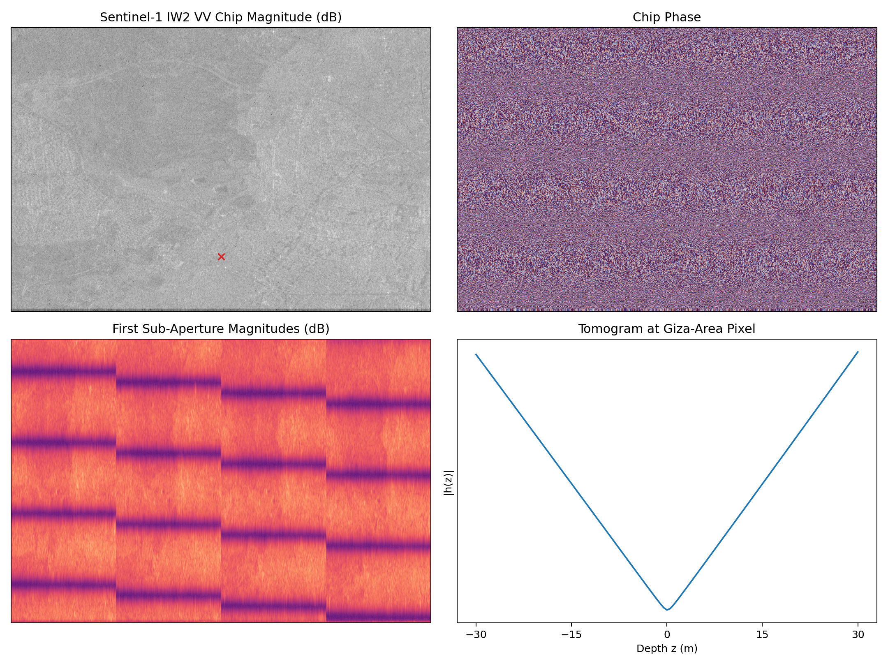
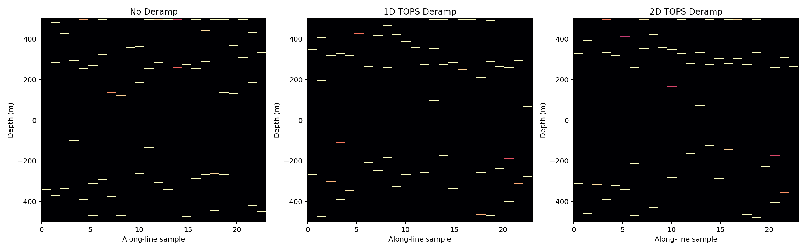
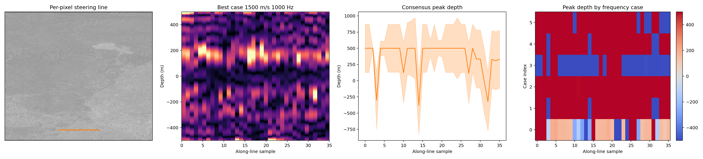
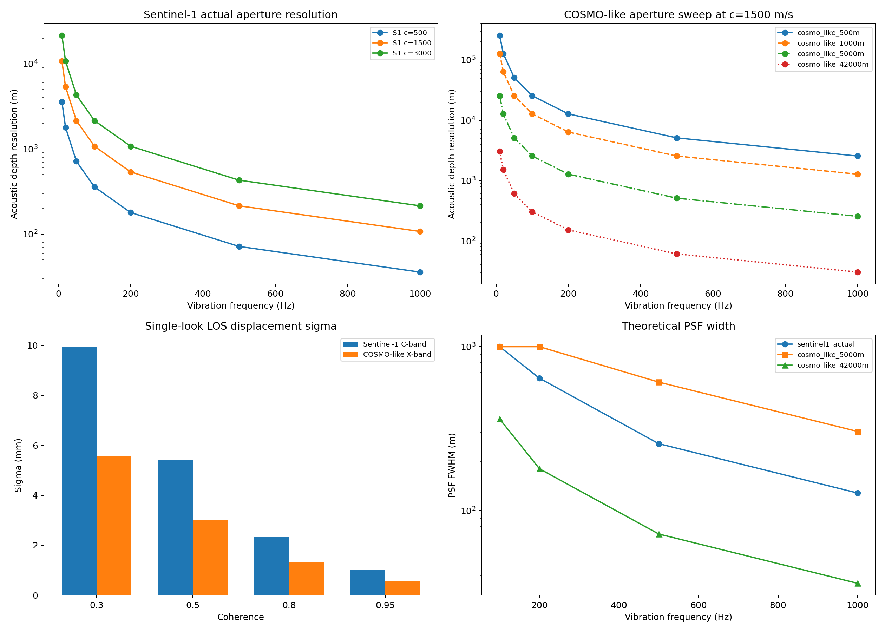

# Pyramid

Reverse-engineering and testing Filippo Biondi's SAR Doppler tomography ideas against open SAR data, with a focus on the Giza pyramids.

This repository is both:

- a research sandbox for trying Biondi-style single-acquisition Doppler/sub-aperture tomography
- a record of what worked, what failed, and what the current physics-based limits appear to be on open Sentinel-1 data

## Current status

The short version:

- we successfully ingested a real Sentinel-1A Giza SLC scene
- we reproduced several families of sub-aperture tomography pipelines
- we built an interactive slice explorer
- we tested many variants of a Biondi-like displacement/acoustic focusing approach
- we did **not** obtain robust, defensible subsurface imagery from open Sentinel-1 IW TOPS data

The current evidence points to a hard limit in the available geometry, not just a tuning problem.

## What is in this repo

- `sardt.py`: baseline EM-style TomoSAR utilities
- `giza_backend.py`: Sentinel-1 SAFE ingestion, target localization, geometry derivation, and slice/point helpers
- `biondi_core.py`: Biondi-style displacement tracking, acoustic steering, and TOPS deramping experiments
- `app.py`: interactive Flask viewer for top-down SAR plus vertical slices
- `experiments/`: runnable experiments, sweeps, and feasibility checks

## Main experiments

- `experiments/run_sentinel1_giza_test.py`
  First real-data Giza smoke test on Sentinel-1 `IW2 VV`
- `experiments/run_hypothesis_loop.py`
  EM-style tomography sweeps over measurement and inversion variants
- `experiments/run_biondi_hypothesis_loop.py`
  Biondi-style displacement/acoustic hypothesis sweeps
- `experiments/run_biondi_perpixel_slice_scan.py`
  Global slice inversion with per-pixel steering and frequency sweeps
- `experiments/run_sensor_feasibility_model.py`
  Theoretical resolution/conditioning/displacement-limit model for Sentinel-1 and illustrative COSMO-like apertures

## Key results

### 1. Real Giza Sentinel-1 data works as an input

This is the Giza-area `IW2 VV` chip extracted from the Sentinel-1 scene:



That confirmed the ingestion, geolocation, swath selection, and complex-data processing path.

### 2. TOPS-aware preprocessing improved tracking, but not enough

We compared no deramp, simple deramp, and 2D deramp before Biondi-style tracking:



Tracking metrics improved, but the inversion still failed to produce stable depth-resolved structure.

### 3. Per-pixel steering still produced unstable depth peaks

The strongest remaining open-data variant used per-point steering inside the slice solver:



This was still not robust. Depth peaks moved under small parameter changes and often collapsed to the depth-range edges.

### 4. The feasibility math is the most important result

The theoretical model is here:



The model computes:

- aperture-limited acoustic depth resolution
- steering-matrix conditioning and PSF width
- phase-based displacement precision bounds

For the actual Sentinel-1 Giza geometry, the numbers are unfavorable:

- actual Sentinel-1 aperture span used by the model: about `11.86 km`
- EM-style TomoSAR vertical resolution: about `4.62 km`
- acoustic-style resolution at `c = 1500 m/s`, `f = 500 Hz`: about `215 m`
- acoustic-style resolution at `c = 1500 m/s`, `f = 1000 Hz`: about `108 m`

Those bounds explain why the reconstructions do not show meter-scale buried structure.

## Interpretation

The most defensible current conclusion is:

- open Sentinel-1 IW TOPS data does not appear sufficient to reproduce Biondi-style subsurface imagery in a robust way
- the failure mode is not only implementation error; the geometry and conditioning look fundamentally weak for the target claim
- if the published results are reproducible, they likely depend on materially different data and/or a stronger forward model than what is inferable from the papers alone

This does **not** prove Biondi's results are impossible in all settings. It does show that a broad set of plausible reconstructions on open Sentinel-1 data fail, and that the theoretical bounds for this scene are poor.

## Running the code

Create a Python environment with the packages already used in this repo:

```bash
python3 -m venv .venv
. .venv/bin/activate
pip install numpy matplotlib tifffile flask
```

Run the interactive viewer:

```bash
MPLCONFIGDIR=/tmp/mpl .venv/bin/python app.py
```

Then open `http://127.0.0.1:5001`.

Run the main feasibility model:

```bash
MPLCONFIGDIR=/tmp/mpl .venv/bin/python experiments/run_sensor_feasibility_model.py
```

## Data

This repo does **not** include the multi-gigabyte raw SAR inputs.

The main Giza scene used in the experiments was:

- `S1A_IW_SLC__1SDV_20160706T155618_20160706T155645_012030_012959_83DC`

It can be obtained from ASF / NASA Earthdata:

- ASF datapool ZIP:
  `https://datapool.asf.alaska.edu/SLC/SA/S1A_IW_SLC__1SDV_20160706T155618_20160706T155645_012030_012959_83DC.zip`
- CMR granule search:
  `https://cmr.earthdata.nasa.gov/search/granules.json?collection_concept_id=C1214470488-ASF&temporal=2016-07-06T00:00:00Z,2016-07-06T23:59:59Z&point=31.1342,29.9792&page_size=20`

Notes for anyone trying to rerun the tests:

- you need a NASA Earthdata account
- you need to authorize the ASF application for that account
- programmatic download works most easily with a `~/.netrc` entry for `urs.earthdata.nasa.gov`

Minimal `~/.netrc` example:

```text
machine urs.earthdata.nasa.gov
login YOUR_USERNAME
password YOUR_PASSWORD
```

If ASF access has not been authorized yet, log in once through:

- `https://sentinel1.asf.alaska.edu/login`

The public figures and JSON summaries included in this repo are enough to inspect the results, but contributors will need to obtain the original SAR product themselves for full reruns.

## Open questions

- Can the Biondi papers be reverse-engineered more faithfully from public descriptions alone?
- Is the missing ingredient mostly data mode, mostly forward model, or both?
- Would spotlight/staring commercial SAR materially change the feasibility bounds?
- Is there a defensible passive-vibration interpretation here that does not overstate subsurface claims?

## Contributing

Useful contributions would include:

- better derivations of the Biondi forward model from published sources
- stronger burst-domain / spotlight-domain processing
- independent checks of the feasibility math
- alternative open datasets with more favorable geometry
- skeptical reproductions and failure analyses

This repo is intended to be scientifically useful even if the answer remains negative.
